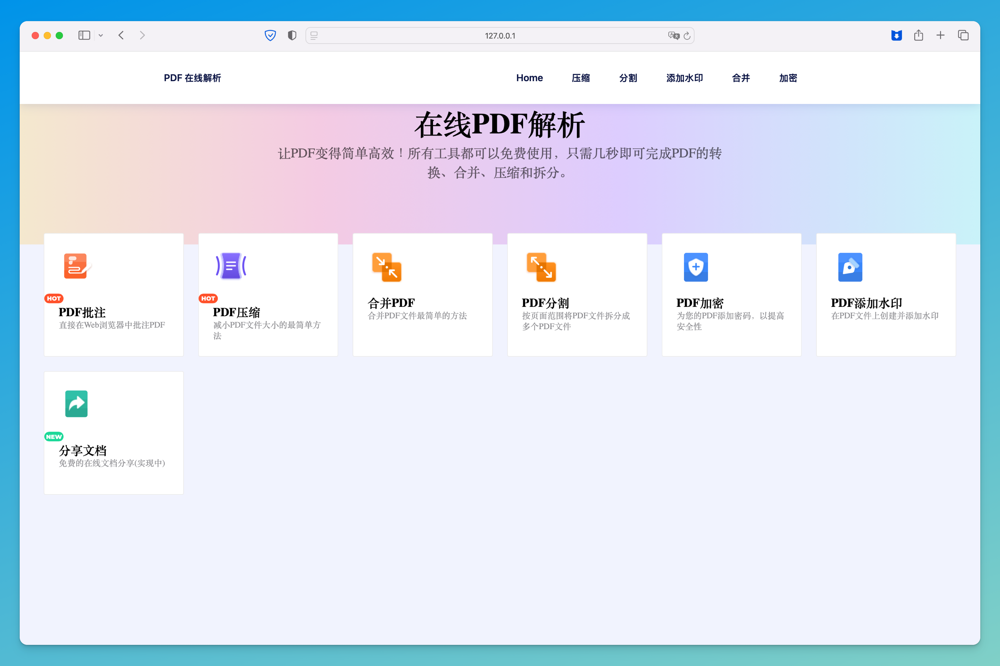
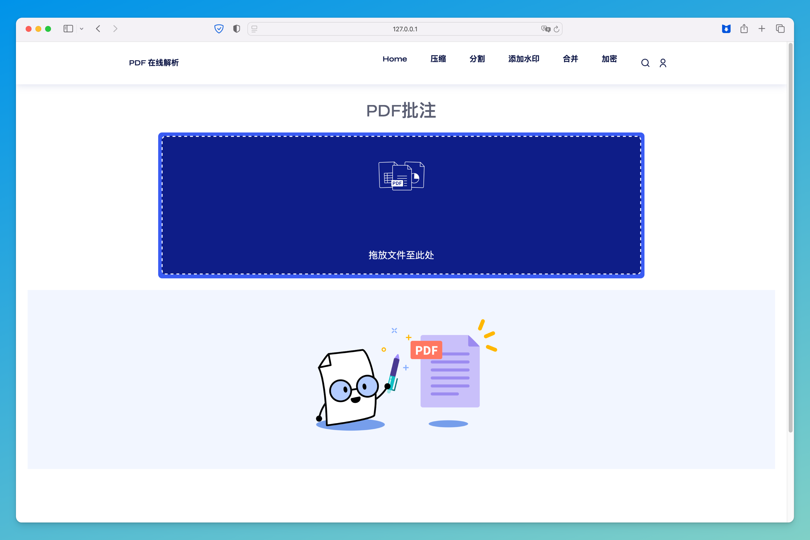

<h1 align="center">🎊 Flask pdf editer 🎊</h1>
<div align="center">
	
    
  </a>
  <p align="center"> Simple pdf editer with python and flask. </p>
</div>

# 介绍


> [!WARNING]  
> 本项目仅用于学习 flask 框架的基本使用。

这是合肥工业大学的课程设计项目，实现一个在线的pdf编辑系统，需要实现pdf文档的批注、压缩、合并、分割、加密和添加水印等功能。

项目极度精简，并未采用前后端分离，仅采用HTML+css+JavaScript实现。

# 项目依赖

运行前请自行添加如下依赖。

- PyPDF2
- flask

# 运行

运行前确保static文件夹下有以下两个子目录：

- static/download/files_to_zip
- static/upload/merge

```shell
mkdir -p static/download/files_to_zip
mkdir -p static/upload/merge
```

然后 `flask run` 即可运行。

# 运行截图





